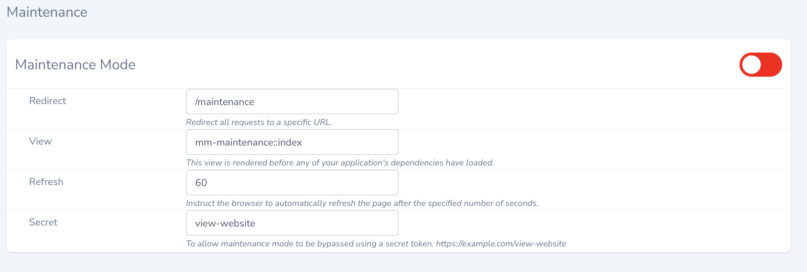
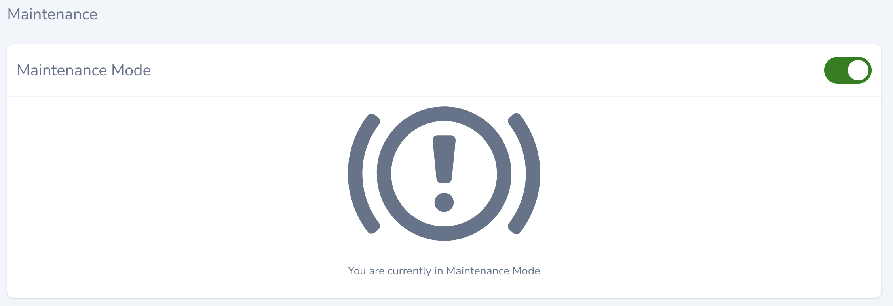

# Maintenance Mode in Nova

This package allows you to manage the Maintenance Mode for your application in Nova

## Installation

You can install the package in to a Laravel app that uses [Nova](https://nova.laravel.com) via composer:

```bash
composer require marshmallow/maintenance
```

To publish the config and view to give you more control. Run this command:

```bash
php artisan vendor:publish --tag="mm-maintenance"
```

Two files have been added to your project:

Maintenance page:
`resources/views/vendor/marshmallow/maintenance`

Config file:
`config/maintenance.php`

Next up, you must register the tool with Nova. This is typically done in the `tools` method of the `NovaServiceProvider`.

```php
// in app/Providers/NovaServiceProvider.php
use Marshmallow\Maintenance\Maintenance;

public function tools()
{
    return [
        // ...
        new Maintenance,
    ];
}
```

## Usage

Click on the "Maintenance Mode" menu item in your Nova app to see the tool provided by this package.




## Custom view

When you have build you own maintenance mode page, you can view this by updating the config file and update the value of the `render` key. For example:

```php
// in config/maintenance.php
return [
    // ...
    'render' => 'maintenance.index',
];
```

Your file structure will look like this:
`resources/views/maintenance/index.blade.php`

Or you can change the default view that comes with the package after installation.
`resources/views/vendor/marshmallow/maintenance/index.blade.php`

## Credits
-   [Lucien Versendaal](https://github.com/lucienversendaal)
-   [All contributors](https://github.com/marshmallow-packages/laravel-nova-maintenance/graphs/contributors)

## License

The MIT License (MIT). Please see [License File](LICENSE.md) for more information.
